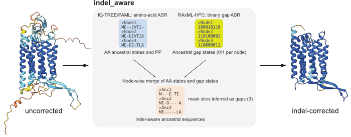

# ConsistASR

ConsistASR is a collection of small, modular scripts for **indel-aware ancestral sequence reconstruction (ASR)** and **confidence mapping** on AlphaFold models.

The main focus is on 7-transmembrane (7TM) microbial rhodopsins (e.g., heliorhodopsins and schizorhodopsins), but the workflow is in principle applicable to other protein families.

The repository provides:

- An **IQ-TREE–based indel-aware pipeline** (`iqtree_pipeline/indel_aware`)
- A corresponding **RAxML + PAML indel-aware pipeline** (`raxml_paml_pipeline/indel_aware`)
- **Confidence mapping (“confmap”)** scripts to embed ASR posterior probability (PP) and pLDDT into B-factors of AlphaFold models
- **FASTA ID utilities** to sanitize headers before going through PHYLIP-style formats
- A simple **pre-clustering / filtering script** to reduce very large FASTA sets before tree building



The design philosophy is:

- Prefer **small, explicit scripts** over a fully “black-box” pipeline
- Each major step is a separate script with a clear interface
- Users are encouraged to check models, trees, and ASR settings at each stage

---

## Repository layout

```text
ConsistASR
├── README.md
├── environment.yml
├── fasta_id_tools
│   ├── README.md
│   ├── fasta_rename_sequential.py
│   ├── fasta_sanitize_id_underscore.py
│   └── fasta_truncate_id_simple.py
├── iqtree_pipeline
│   ├── confmap
│   │   ├── README.md
│   │   ├── map_confidence_to_bfactor.py
│   │   └── run_confmap_iqtree.sh
│   ├── examples
│   │   ├── ASR/        # IQ-TREE ASR outputs for toy 7TM rhodopsin dataset
│   │   ├── Tree/       # IQ-TREE tree search outputs
│   │   ├── confmap/    # Example confmap outputs for Node10
│   │   ├── indel_aware/# Example indel-aware outputs for IQ-TREE pipeline
│   │   └── toy_7tm_rhodopsin.fasta
│   └── indel_aware
│       ├── README.md
│       ├── map_raxml_to_iqtree_nodes.py
│       ├── msa_to_binary.py
│       ├── run_indel_aware_iqtree.sh
│       └── state_and_indel_to_fasta.py
├── precluster_tools
│   ├── README.md
│   └── filter_cluster_generic.sh
└── raxml_paml_pipeline
    ├── confmap
    │   ├── README.md
    │   ├── extract_pp_from_paml_rst.py
    │   ├── map_confidence_to_bfactor.py
    │   └── run_confmap_paml.sh
    ├── examples
    │   ├── ASR/        # PAML ASR example (toy 7TM rhodopsin)
    │   ├── Tree/       # RAxML tree example
    │   ├── confmap/    # Example confmap outputs for Node28
    │   ├── indel_aware/# Example indel-aware outputs for RAxML + PAML pipeline
    │   └── toy_7tm_rhodopsin.fasta
    └── indel_aware
        ├── README.md
        ├── map_raxml_to_paml_nodes_from_rst.py
        ├── msa_to_binary.py
        ├── paml_state_and_indel_to_fasta.py
        └── run_indel_aware_paml.sh
```

Each subdirectory (`iqtree_pipeline/indel_aware`, `iqtree_pipeline/confmap`, `raxml_paml_pipeline/indel_aware`, `raxml_paml_pipeline/confmap`, `fasta_id_tools`, `precluster_tools`) has its own `README.md` describing the interface and usage in more detail.

---

## Installation

We recommend using a dedicated conda/mamba environment.

### 1. Create and activate the environment

From the top-level `ConsistASR` directory:

```bash
mamba env create -f environment.yml   # or: conda env create -f environment.yml
conda activate ConsistASR
```

This installs:

* Python (≥ 3.10)
* IQ-TREE, RAxML-HPC, RAxML-NG, PAML, MAFFT, FastTree
* seqkit, CD-HIT, trimAl
* Biopython, gemmi, ETE3
* basic scientific Python stack (numpy, pandas)

Alternatively, all of the above can be installed on Conda (Bioconda + Conda Forge), e.g.:

```bash
conda install -c conda-forge -c bioconda \
  iqtree raxml raxml-ng paml mafft fasttree seqkit cd-hit gemmi biopython
```

### 2. Additional tools

Some external tools are **not** included in `environment.yml` and must be installed separately:

* **Treemmer**

  Used in `precluster_tools/filter_cluster_generic.sh` for tree-based reduction of large sequence sets.

  * Requires `ete3` (already included in the environment)
  * Install Treemmer from its GitHub repository and ensure the main script
    (e.g. `Treemmer_v0.3.py`) is reachable via the path used in the script or your `$PATH`

* **AlphaFold**

  The `confmap` scripts assume that AlphaFold has already been run for the ancestral sequence(s) of interest, and that the AlphaFold output directory contains:

  * `*_summary_confidences_*.json`
  * `*_model_X.cif`
  * `msas/`, `templates/`, etc.

  AlphaFold itself is **not** included here and must be set up separately (local or cluster installation).

* **Visualization tools (optional)**

  * PyMOL, ChimeraX, or other molecular viewers
  * These are used to visualize B-factor–encoded PP / pLDDT / PP×pLDDT, but are not required to run the scripts.

---

## Tested environment

The scripts have been tested on the following systems:

* **macOS** (Intel laptop)

  * macOS 13.7.8 (Ventura)
  * Conda/mamba environment: `ConsistASR` (see `environment.yml`)

* **Ubuntu (WSL2 on Windows)**

  * Ubuntu 22.04 LTS (WSL2)
  * Same `ConsistASR` conda environment

Key tool versions used during testing:

| Tool      | Version (macOS / Ubuntu)|
| --------- | ----------------------- |
| IQ-TREE   | 3.0.1 / 3.0.1           |
| RAxML-NG  | 1.2.2 / 1.2.2           |
| RAxML-HPC | 8.2.12 / 8.2.13         |
| PAML      | 4.10.7 / 4.10.7         |
| MAFFT     | 7.525 / 7.525           |
| FastTree  | 2.2.0 / 2.2.0           |
| CD-HIT    | 4.8.1 / 4.8.1           |
| SeqKit    | 2.10.1 / 2.12.0         |
| Biopython | 1.85 / 1.86             |
| Gemmi     | 0.7.3 / 0.7.4           |
| ETE3      | 3.1.3 / 3.1.3           |
| Treemmer  | 0.3 (GitHub)            |

Other versions will probably work, but these are the versions we actually used to validate the examples in `iqtree_pipeline/examples` and `raxml_paml_pipeline/examples`.

---

## Overview of the pipelines

### 1. IQ-TREE indel-aware pipeline

`iqtree_pipeline/indel_aware/` provides a small wrapper to make **indel-aware ASR** using IQ-TREE outputs:

* Input:

  * Amino-acid MSA (`--msa`)
  * IQ-TREE topology (`--tree`)
  * IQ-TREE ASR `.state` file (`--state`)
  * Outgroup taxa list (`--outgroup`)

* Main script: `run_indel_aware_iqtree.sh`

  * Converts MSA to a binary (0/1) gap matrix (`msa_to_binary.py`)
  * Evaluates the topology with RAxML-NG (BIN+G)
  * Runs RAxML-HPC binary ASR (indels)
  * Maps RAxML internal node IDs back to IQ-TREE node labels (`map_raxml_to_iqtree_nodes.py`)
  * Produces:

    * gap-aware ancestral FASTA with gaps
    * gap-stripped ancestral FASTA
    * a node mapping table

See `iqtree_pipeline/indel_aware/README.md` and the toy example in `iqtree_pipeline/examples`.

---

### 2. IQ-TREE confmap (PP / pLDDT mapping)

`iqtree_pipeline/confmap/` provides scripts to **map ASR PP and AlphaFold pLDDT to B-factors**:

* `run_confmap_iqtree.sh`

  * Selects the best AlphaFold model from `*_summary_confidences_*.json`
  * Converts mmCIF to PDB (keeping pLDDT in B-factors)
  * Extracts site-wise PP from IQ-TREE `.state`
  * Maps PP to B-factors using `map_confidence_to_bfactor.py`
  * Generates:

    * PDB with pLDDT
    * PDB with PP
    * PDB with scaled PP − pLDDT
    * PDB with PP × pLDDT
    * CA-only statistics for each metric

These outputs can be visualized in PyMOL or ChimeraX.

---

### 3. RAxML + PAML pipeline

`raxml_paml_pipeline/indel_aware/` and `raxml_paml_pipeline/confmap/` implement an analogous workflow for **PAML-based ASR**:

* `raxml_paml_pipeline/indel_aware`:

  * Uses a PAML `.rst` and the RAxML tree used for the PAML run
  * Performs binary (indel) ASR with RAxML-HPC
  * Extracts the PAML internal-node tree from `.rst`
  * Maps RAxML internal nodes to PAML node IDs (`map_raxml_to_paml_nodes_from_rst.py`)
  * Produces gap-aware ancestral FASTA (with/without gaps) for all nodes

* `raxml_paml_pipeline/confmap`:

  * `run_confmap_paml.sh` reads a PAML `.rst` and a with-gap ancestral FASTA
  * Extracts PP per alignment column for a given PAML node ID
  * Maps PP and AlphaFold pLDDT to B-factors (as in the IQ-TREE version)
  * Outputs PDBs for PP, PP − pLDDT, PP × pLDDT and a statistics log

See `raxml_paml_pipeline/*/README.md` and `raxml_paml_pipeline/examples`.

---

### 4. FASTA ID utilities

`fasta_id_tools/` contains small helper scripts to avoid PHYLIP/RAxML troubles with spaces and special characters in FASTA headers:

* `fasta_rename_sequential.py`

  * Renames all sequences to `seq0001`, `seq0002`, …
  * Writes a two-column mapping table (old ID → new ID)

* `fasta_truncate_id_simple.py`

  * Truncates each ID at the first non-alphanumeric/underscore character
  * E.g.

    * `AM_5S_00009|AM_5S-c1__...` → `AM_5S_00009`
    * `QBQ84358.1 schizorhodopsin [...]` → `QBQ84358`

* `fasta_sanitize_id_underscore.py`

  * Replaces spaces and problematic symbols with underscores
  * E.g.

    * `SAMEA 2622822_312577` → `SAMEA_2622822_312577`

Each script has its own usage examples in `fasta_id_tools/README.md`.

---

### 5. Pre-cluster tools

`precluster_tools/filter_cluster_generic.sh` implements a **generic pre-filtering & clustering workflow**:

* Cleans sequences (remove non-amino-acid characters)
* Applies a length filter (e.g., ≥ 200 aa; configurable)
* Filters by presence of one or more residues (e.g., K; configurable)
* Removes exact duplicates
* Runs CD-HIT at several identity thresholds
* Optionally aligns and reduces the dataset with MAFFT + FastTree + Treemmer
* Writes a small report summarizing the reduction

This is intended as a **pre-processing step** to obtain a reasonable number of representative sequences before serious ASR.

See `precluster_tools/README.md` for details.

---

## Toy example: 7TM rhodopsin dataset

Both the IQ-TREE and RAxML + PAML pipelines include a small toy dataset:

* `iqtree_pipeline/examples/toy_7tm_rhodopsin.fasta`
* `raxml_paml_pipeline/examples/toy_7tm_rhodopsin.fasta`

Example outputs (trees, ASR state files, indel-aware FASTA, confmap PDBs) are provided under the corresponding `examples/` subdirectories, so users can:

1. Inspect intermediate files
2. Re-run the scripts step by step
3. Compare their outputs with the bundled ones

In the toy 7TM rhodopsin dataset, the two outgroup sequences are:

- `OG_WP_285271495`
- `OG_WP_136361479`

These IDs must be passed to the pipelines as the `--outgroup` argument.

### IQ-TREE pipeline: quick start on the toy dataset

All commands below are meant to be run from `iqtree_pipeline/examples/`.
These commands are not meant to be an optimal analysis pipeline, but just to demonstrate how the scripts work on a small 7TM rhodopsin dataset.

**Run IQ-TREE ML tree inference** (using the same settings as in the paper):

```bash
iqtree3 -s toy_7tm_rhodopsin.fasta \
		-m Q.pfam+I+G4 \
		-bb 1000 -alrt 1000 \
		-o OG_WP_285271495,OG_WP_136361479
```
This produces, among others:

- `toy_7tm_rhodopsin.fasta.treefile` – ML tree with SH-aLRT / UFBoot
- `toy_7tm_rhodopsin.fasta.contree` – consensus tree with UFBoot2

**Run IQ-TREE ASR**

```bash
iqtree3 -s toy_7tm_rhodopsin.fasta \
        -m Q.pfam+I+G4 \
        -te toy_7tm_rhodopsin.fasta.treefile \
        -o OG_WP_285271495,OG_WP_136361479 \
        --ancestral \
        -pre ASR_toy_7tm_rhodopsin \
        -seed 12345
```
This produces, among others:

- `ASR_toy_7tm_rhodopsin.state` – IQ-TREE ASR output (site-wise posteriors)

**Run the indel-aware ASR wrapper** to obtain gap-aware ancestors:

Copy the scripts in the `iqtree_pipeline/indel_aware` folder to the current working directory.

```bash 
bash run_indel_aware_iqtree.sh \
  --msa   toy_7tm_rhodopsin.fasta \
  --tree  ASR_toy_7tm_rhodopsin.treefile \
  --state ASR_toy_7tm_rhodopsin.state \
  --prefix ASR_toy_7tm_rhodopsin \
  --outgroup "OG_WP_285271495,OG_WP_136361479"
```
This produces, for all internal nodes:

- `ASR_toy_7tm_rhodopsin_indel_withgap.fasta` – indel-aware ancestor sequences retaining alignment gaps
- `ASR_toy_7tm_rhodopsin_indel_nogap.fasta` – gap-stripped versions used for AlphaFold and summary statistics
- `ASR_toy_7tm_rhodopsin_indel_work/` – intermediate RAxML(-NG) files

**Map PP / PP×pLDDT / PP−pLDDT onto an AlphaFold model** for a focal ancestor
(e.g. node name `Node10` in the toy example):

```bash
cd confmap/Node10   # directory containing the AlphaFold CIF/JSON
```
Copy the scripts in the `iqtree_pipeline/confmap` folder, `.state` and `withgap.fasta` files to the current working directory.

```bash
bash run_confmap_iqtree.sh \
  --state ASR_toy_7tm_rhodopsin.state \
  --node  Node10 \
  --withgap   ASR_toy_7tm_rhodopsin_indel_withgap.fasta \
  --outdir confmap
```
This creates in `confmap/`:

- `Node10_plddt_bfactor.pdb` – pLDDT in B-factor
- `Node10_pp_bfactor.pdb` – PP in B-factor
- `Node10_ppminusplddt_bfactor.pdb` – scaled PP−pLDDT in B-factor
- `Node10_ppxplddt_bfactor.pdb` – PP×pLDDT in B-factor
- `Node10_conf_CA_stats.log` – summary statistics for all metrics

### RAxML + PAML pipeline: quick start on the toy dataset

All commands below are meant to be run from `raxml_paml_pipeline/examples/`.

**Run RAxML-NG ML tree inference** (using the same settings as in the paper):

```bash
raxml-ng \
  --all \
  --msa toy_7tm_rhodopsin.fasta \
  --model LG+F+G \
  --bs-metric tbe \
  --tree rand{1} \
  --bs-trees 1000 \
  --seed 12345 \
  --outgroup OG_WP_285271495,OG_WP_136361479 \
  --prefix toy_7tm_rhodopsin
```
This produces, among others:

- `toy_7tm_rhodopsin.raxml.bestTree` – ML tree

**Run PAML codeml** for amino-acid ASR on the RAxML tree
(either via run\_paml\_asr.py or a manually edited codeml.ctl):

- `run_paml_asr.py`  
  Minimal helper script that generates a codeml `.ctl` file for an amino-acid
  LG+Γ ASR run and executes `codeml`. This is provided only as an **example**
  to reproduce the PAML settings used in the toy 7TM rhodopsin dataset.
  Most PAML users will prefer to edit `.ctl` files manually for their own data.
  
```bash
python run_paml_asr.py \
  --aln    toy_7tm_rhodopsin.fasta \
  --tree   toy_7tm_rhodopsin.raxml.bestTree \
  --prefix ASR_toy_7tm_rhodopsin
```
This produces, among others:

- `rst` – PAML ASR output (site-wise posteriors)

**Run the indel-aware ASR wrapper** to obtain gap-aware ancestors:

Copy the scripts in the `raxml_paml_pipeline/indel_aware` folder to the current working directory.

```bash 
bash run_indel_aware_paml.sh \
  --msa   toy_7tm_rhodopsin.fasta \
  --tree  toy_7tm_rhodopsin.raxml.bestTree \
  --rst   rst \
  --prefix ASR_toy_7tm_rhodopsin \
  --outgroup "OG_WP_285271495,OG_WP_136361479"
```
This produces, for all internal nodes:

- `ASR_toy_7tm_rhodopsin_indel_withgap.fasta` – indel-aware ancestor sequences retaining alignment gaps
- `ASR_toy_7tm_rhodopsin_indel_nogap.fasta` – gap-stripped versions used for AlphaFold and summary statistics
- `ASR_toy_7tm_rhodopsin_indel_work/` – intermediate RAxML(-NG) files

**Map PP / PP×pLDDT / PP−pLDDT onto an AlphaFold model** for a focal ancestor
(e.g. node name `28` in the toy example):

```bash
cd confmap/Node28   # directory containing the AlphaFold CIF/JSON
```
Copy the scripts in the `raxml_paml_pipeline/confmap` folder, `rst` and `withgap.fasta` files to the current working directory.

```bash
bash run_confmap_paml.sh \
  --rst   rst \
  --node  28 \
  --withgap   ASR_toy_7tm_rhodopsin_indel_withgap.fasta \
  --outdir confmap
```
This produces the same set of PDBs and log files as the IQ-TREE pipeline, now based on PAML ASR.

---

## Citation

If you use ConsistASR in your work, please cite:

* **[Manuscript title, authors, journal, year]** – *TBD*

---
