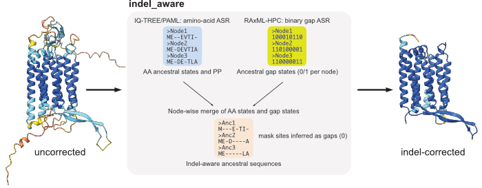
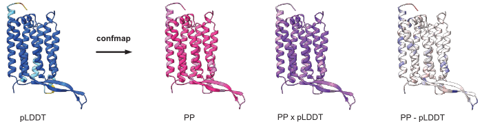

# ConsistASR

[](https://doi.org/10.5281/zenodo.18080327)

ConsistASR is a collection of small, modular scripts for **indel-aware ancestral sequence reconstruction (ASR)** and **confidence mapping** on AlphaFold models.

The main focus is on full-length 7-transmembrane (7TM) microbial rhodopsins, including heliorhodopsins and schizorhodopsins, but the workflow is in principle applicable to other protein families.

---
## What ConsistASR does

ConsistASR provides tools to:

- extract **raw ancestral protein sequences** as FASTA files from **IQ-TREE `.state`** and **PAML `rst`** outputs
- generate **indel-aware corrected ancestral FASTA files** by combining amino-acid ASR with binary gap-state reconstruction
- map **ASR posterior probability (PP), AlphaFold pLDDT, PP × pLDDT, and PP − pLDDT onto AlphaFold models** via B-factors
- sanitize FASTA headers before using PHYLIP/RAxML/PAML-style workflows
- pre-filter and cluster large sequence datasets before tree building
- perform ESR proxy validation for checking whether known extant sequences can be reconstructed from phylogenetic context

---
## Indel-aware ASR workflow

ConsistASR includes two indel-aware ASR workflows:

- `iqtree_pipeline/indel_aware/` for IQ-TREE `.state` outputs
- `raxml_paml_pipeline/indel_aware/` for PAML `rst` outputs



---
## Confidence mapping workflow

The `confmap` scripts map ASR posterior probability and AlphaFold confidence metrics onto PDB B-factors for visualization in PyMOL, ChimeraX, or related tools.



---
## Installation (quick)

From the top-level `ConsistASR` directory:

```bash
git clone https://github.com/harutois/ConsistASR.git
cd ConsistASR
mamba env create -f environment.yml   # or: conda env create -f environment.yml
conda activate ConsistASR
```

For detailed installation, pipeline descriptions, and examples, please see the main documentation:

👉 [`ConsistASR/README.md`](ConsistASR/README.md)

The recommended conda environment uses Python `>=3.10,<3.13`. This upper bound is mainly for compatibility with Treemmer, which depends on the deprecated Python `cgi` module removed in Python 3.13.

---
## What's new in v1.1.0

Compared with v1.0.1, ConsistASR v1.1.0 adds:

- raw ASR FASTA extraction from IQ-TREE `.state` outputs
- raw ASR FASTA extraction from PAML `rst` outputs
- UniProt-style FASTA header renaming utility
- generalized ESR proxy validation utilities
- updated toy examples and documentation

---
## Background reference

The binary gap-state reconstruction strategy used in the indel-aware workflow follows the general idea described in:

- Aadland, K., Pugh, C., Kolaczkowski, B. High-Throughput Reconstruction of Ancestral Protein Sequence, Structure, and Molecular Function. In: Sikosek, T. (eds) Computational Methods in Protein Evolution. *Methods Mol. Biol.* vol 1851. Humana Press, New York, NY. (2019). https://doi.org/10.1007/978-1-4939-8736-8_8

---
## Citation

If you use ConsistASR in your work, please cite the associated paper:

- Ishikawa, H. and Mizutani, Y. Resurrecting Full-Length Ancestral Schizorhodopsins and Heliorhodopsins with Structure-Guided, Indel-Aware Sequence Reconstruction. *ACS Omega* (2026). https://doi.org/10.1021/acsomega.6c03010

Please also cite the software archive. For the latest version, use the Zenodo concept DOI:

- ConsistASR. Zenodo. https://doi.org/10.5281/zenodo.18080327

For an exact release, please cite the version-specific DOI listed on Zenodo for that release.

---